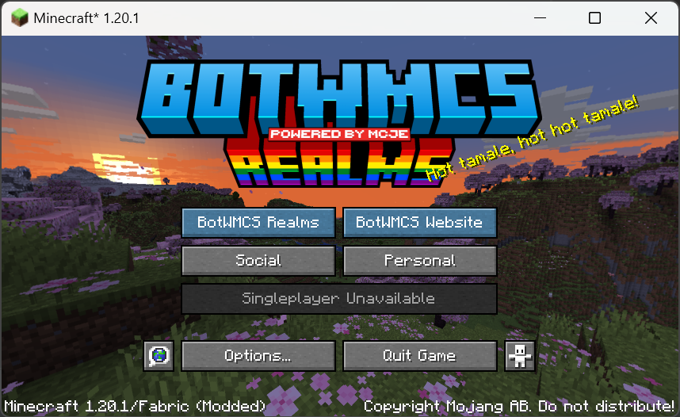

# Realms for Fabric
A mod that tweak Minecraft into BotWMCS client

## Features
- Running on 1.20.1, Fabric platform
- Add social networks for BotWMCS server
- Add player's skin changer (Basic by CPM mod)
- Add server official global market
- This mod has a grand update system. It can easily download and load mods on fire.

## Copyright
- BotWMCS official mod. You can use some code in this mod.
- This mod is MIT license.
- If you like this mod's GUI style, there's an abstract GUI component of this mod called "Palette API".